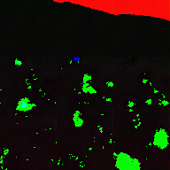

D16:
----------

Milestones:
1. This is my 16th day and I am excited to start learning ASP.NET Core with Angular 8 MVC. This is my go-to framework moving forward.
2. Continued on my ride home several cloud topics. Will finish the course very soon.

https://github.com/anvillasoto/bertelsmann-30-days#D15

&#35;30DaysofUdacity

D15:
----------

Milestones:
1. Hurrah! The documentation for our Lunar Segmentation project has been finished. You can look at the result [here](https://github.com/anvillasoto/lunar-segmentation-openvino). 
2. I am on the process on deploying this on Node server with MQTT enabled on a live server. Probably Elastic Beanstalk is way to go instead of provisioning EC2 instance. I do not need that level of control for the meantime.

https://github.com/anvillasoto/bertelsmann-30-days#D15

&#35;30DaysofUdacity

D14:
----------

Milestones:
1. I am currently preparing for the documentation for our LunarX project. Mind you, the pipelined approch for pulling this off using what we learned so far in the Cloud DevOps using AWS Lambda is tricky. But at least we keep our models and our results intact in the process.
2. Still stuck on what I previously learned in the cloud fundamentals section of the course. Will continue it tomorrow since it is holiday in the Philippines and I would have ample time continuing to where I left.

https://github.com/anvillasoto/bertelsmann-30-days#D14

&#35;30DaysofUdacity

D13:
----------

Milestones:
1. Ok. So I finished working on my Lunar Segmentation project using OpenVINO. After hours of tinkering, I finally figured out how to make the Model Optimizer work. Thiis is not much but this is my output. 

2. In between my model training, I continue on the cloud fundamentals course. This is more of a perusal on my end. I will make sure everything will be in place very soon.

https://github.com/anvillasoto/bertelsmann-30-days#D13

&#35;30DaysofUdacity

D12:
----------

Milestones:
1. Finished working on text detection API using Textract. I guess polling for success is the way to go.
2. Continued with the cloud fundamentals course. 

https://github.com/anvillasoto/bertelsmann-30-days#D12

&#35;30DaysofUdacity

D11:
----------

Milestones:
1. Now, I am exploring text detection pipeline for my personal project. Unlike Google Cloud Vision, it is not straightforward as you need to poll if Textract has finished analyzing the document. Will solve this later.
2. Continued with the cloud fundamentals course. 
3. Finished challenge 19-20 of the #testyourgit challenge. So far so good!

https://github.com/anvillasoto/bertelsmann-30-days#D11

&#35;30DaysofUdacity

D10:
----------

Milestones:
1. Ok. I had problems working with NGINX server for my simple cloud project. I am fixing on the gateway timeout issue immediately after setting up SSL.
2. Continued with the cloud fundamentals course. This is getting really exciting. 

https://github.com/anvillasoto/bertelsmann-30-days#D10

&#35;30DaysofUdacity

D09:
----------

Milestones:
1. Continued with cloud fundamentals course. 
2. Explored the AWS Textract for my final project. 

https://github.com/anvillasoto/bertelsmann-30-days#D09

&#35;30DaysofUdacity

D08:
----------

Milestones:
1. Attended a Zoom webinar about the recent AAAI conference in New York. It is all about figuring out the questions of Artificial General Intelligence and enabling AI systems to think and reason instead of our usual one-problem-one-solution method. 
2. Started with cloud fundamentals course. 

https://github.com/anvillasoto/bertelsmann-30-days#D08

&#35;30DaysofUdacity

D07:
----------

Milestone:
1. Focused on finishing the #testyourgit challenge. I am now on exercise 18.  

https://github.com/anvillasoto/bertelsmann-30-days#D07

&#35;30DaysofUdacity

D06:
----------

Milestones:
1. Finished the 14th exercise of the #testyourgit challenge. 
2. Reviewed the whole Git lesson and still on the first half. The combination of revisiting git lessons plus the #testyourgit challenge is really a great way to learn git. 

https://github.com/anvillasoto/bertelsmann-30-days#D06

&#35;30DaysofUdacity

D05:
----------

Milestones:
1. Participated in the Git challenge and I am now on exercise 11 of 23. This is really tough for a beginner like me but I am taking the challenge.
2. Reviewed the whole Git lesson and still on the first half. Will continue tomorrow.

https://github.com/anvillasoto/bertelsmann-30-days#D05

&#35;30DaysofUdacity

D04:
----------

Milestones:
1. Participated in the Git challenge and I am now on exercise 10 of 23. 
2. Finished the whole Git lesson from the challenge course. It was amazing. Will review the material tomorrow.

https://github.com/anvillasoto/bertelsmann-30-days#D04

&#35;30DaysofUdacity

D03:
----------

Milestones:
1. Participated in the Git challenge and I am now on exercise 5 of 23. Will focus on finishing this by tomorrow.

https://github.com/anvillasoto/bertelsmann-30-days#D03

&#35;30DaysofUdacity

D02:
----------

Milestones:
1. Participated in the Git challenge and I am now on exercise 4 of 23. This is really fun. Will continue tomorrow.

https://github.com/anvillasoto/bertelsmann-30-days#D02

&#35;30DaysofUdacity

D01:
----------

Milestone:
1. Finished Lessons 1 to 7 of the Course. I tell you, I am using git for 2 years now and I still learned a lot from the modules. 

This is my first day working on this course. It may be too late but I promise to find the time and finish this as soon as possible.

https://github.com/anvillasoto/bertelsmann-30-days#D01

&#35;30DaysofUdacity